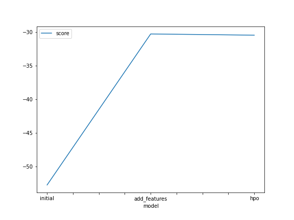
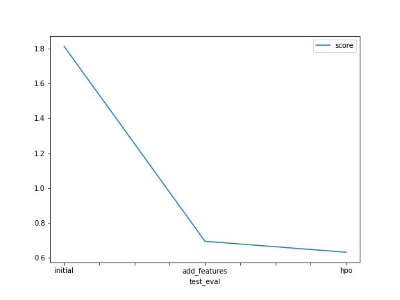

# Report: Predict Bike Sharing Demand with AutoGluon Solution
#### NAME HERE

## Initial Training
### What did you realize when you tried to submit your predictions? What changes were needed to the output of the predictor to submit your results?
After getting the predictions, I realized that all predictions were positve, so no correction to 0 was required. Also, only datetime and count columns needed to be extracted (rest all removed) for submission to Kaggle.

### What was the top ranked model that performed?
WeightedEnsemble_L3

## Exploratory data analysis and feature creation
### What did the exploratory analysis find and how did you add additional features?
The exploratory analysis found the distribution of the features for the whole dataset. I also added additional features as month, day, hour derived from datetime feature using pd.to_datetime.

### How much better did your model preform after adding additional features and why do you think that is?
My score improved from 1.81314 to 0.69427 because of creation of in more relevant month day and hour features instead of just datetime.

## Hyper parameter tuning
### How much better did your model preform after trying different hyper parameters?
I tuned a few hyperparameters such as number of epochs and dropout probability for NN_TORCH as well as number of boost rounds and number of leaves for GBM. My score didn't improve but fell down. Need to study Hyperparameters tuning more.

### If you were given more time with this dataset, where do you think you would spend more time?
I would probably remove month from the features and see the result. Than I would like to learn to tune hyperparameters more.

### Create a table with the models you ran, the hyperparameters modified, and the kaggle score.

model	hpo1	hpo2	hpo3	score
0	initial	default vals	default vals	default vals	1.81314
1	add_features	default vals	default vals	default vals	0.69427
2	hpo	NN_TORCH num_epochs 5, dropout_prob 0.25	GBM num_boost_round 100, num_leaves 36	default vals	1.31959

### Create a line plot showing the top model score for the three (or more) training runs during the project.

### Create a line plot showing the top kaggle score for the three (or more) prediction submissions during the project.

## Summary
I started with initial basic training and then progressed to engineering features and retraining the model. Throughout this process, I encountered some challenges and had to create new cells to address them. Initially, hyperparameter tuning was not clear to me, so I submitted the project based on my limited understanding. Fortunately, I received valuable and constructive feedback from the reviewer, which I incorporated into my work. Unfortunately, I couldn't access the resources for hyperparameter tuning mentioned in the feedback on my PC. As a result, I conducted my own research and discovered a few tunable parameters. I utilized these parameters, but the model's performance did not improve. Currently, I am continuing my research on hyperparameter tuning to gain a better understanding.
